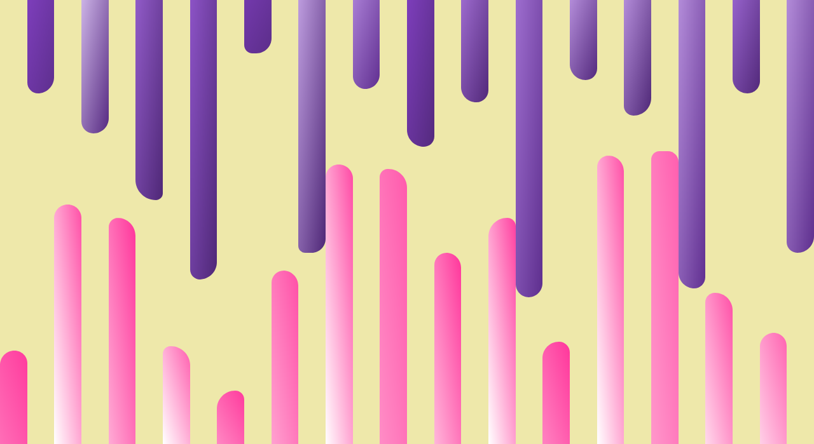

# Random

Let's create some random bars with SASS.

We can make use of SASS loops and the `random()` function that is built-in SASS.

Next, let's animate the bars to increase their height, but randomize the speed.